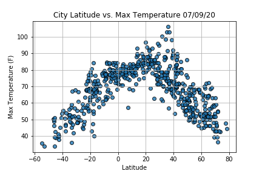
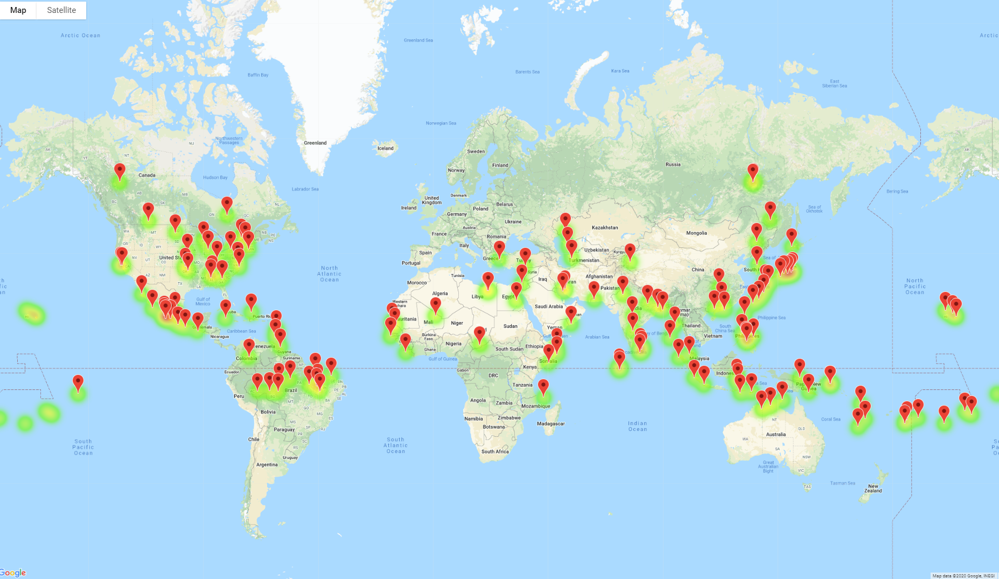
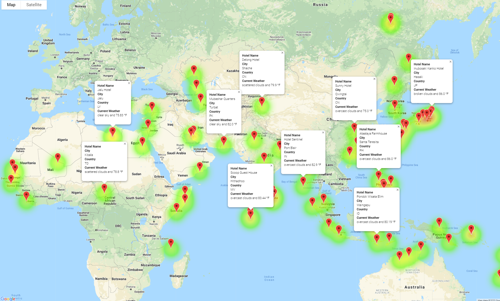
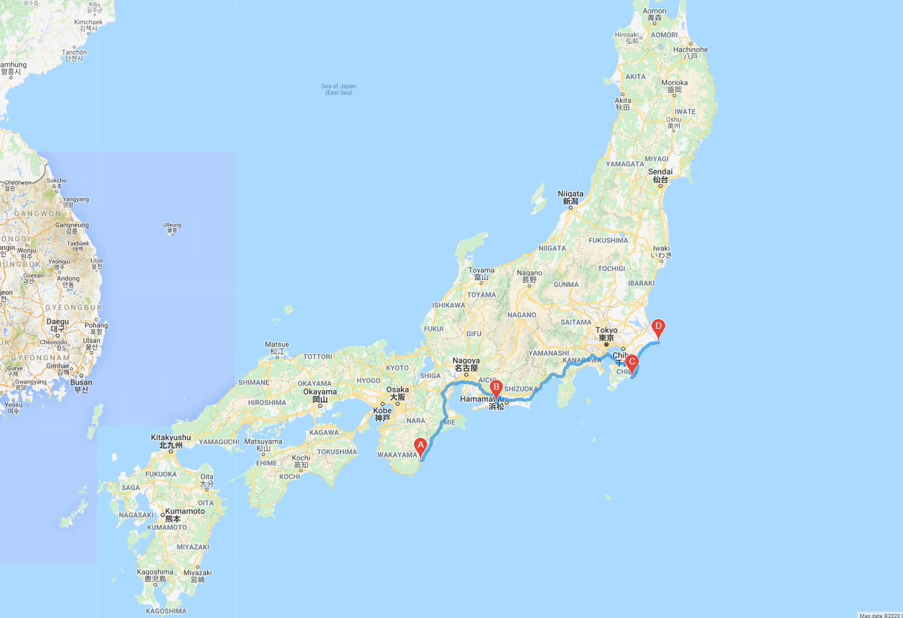
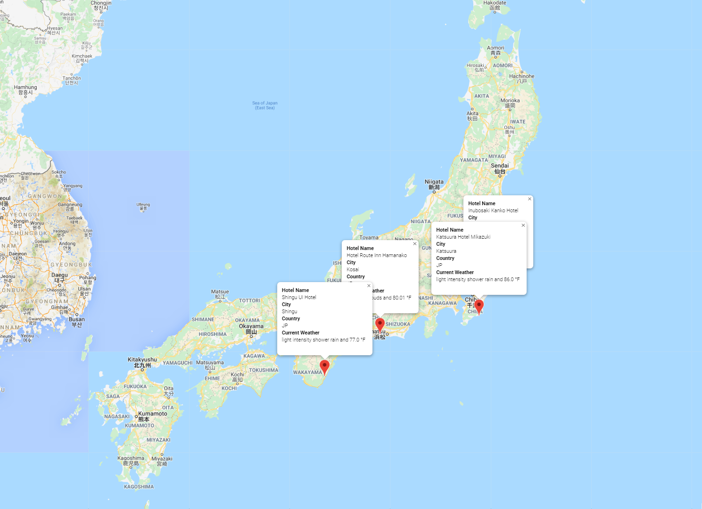

# World Weather Analysis

## Project Overview

Jake is head of analysis of the interface team for PlanMyTrip. It is a travel tech company that specializes in the hotel and lodging industry. He has given the following task to collect and present data to customers via the customer search page which they can filter on their preferred travel. The company will use the data to recommend ideal hotels based on clients' weather preferences.

1.  Collect and analyze weather data across cities worldwide.
2.  Exploratory Anaysis with Visualization
3.  Visualize Travel Data

## Resources
- Data Sources: cities.csv,WeatherPy_database.csv, WeatherPy_vacation.csv
- Software:  Python Data, Jupyter Notebook, Visual Studio Code 1.45.1
- Google Cloud Platform:  Places API, Maps JavaScript API, and Directions API
- OpenWeatherMap.org

## Summary

For this project, pulling data from an API using python request. Created code to randomly generates latitude and longitude pairs. Create a list of cities. Gathered data from OpenWeatherAPI to get weather data at each location. See the chart below. It is a comparison of Max Temperature and City Latitude. Prompted customers for the minimum temperature and maximum temperature preference.

Made a marker layer map to see cities. 

Was able to get a great hotel in each city.

## Challenge Overview

After the app was tested, changes were implemented from feedback from the beta tests. Listed below:

- A weather description to the pop-up markers for customers so that they know what the weather is as they are traveling
- A notation in the search criteria to indicate if it is raining or snowing for customers who are making travel decisions in real-time
- A map that shows the directions for customers’ travel itinerary

## Summary 

Created code to randomly generates a new set of latitude and longitude pairs. Collected data such as Maximum temperature, percent humidity, wind speed, etc. The app prompts the customers for the minimum temperature and maximum temperature preference. Also prompts the user to answers the following questions: "Do you want it to be raining? (yes/no) ". "Do you want it to be snowing? (yes/no) ".

Here are four cities selected for a trip to Japan. Directions between these cites are mapped using gmaps.directions.api. Hotel data can be also found. See the images below.

Great hotel in each city.

